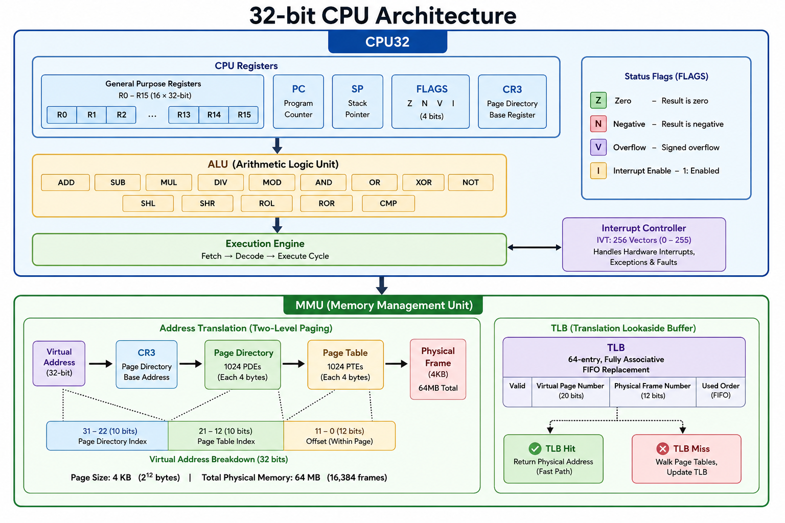

#  32-bit CPU Emulator — From Scratch in C

> **Built entirely from scratch to deeply understand how a CPU, memory management unit (MMU), paging, interrupts, and assembly-level execution work under the hood.**

> **Live demo:** [**cpusimulator-chi.vercel.app**](https://cpusimulator-chi.vercel.app)  
> **Disclaimer:** This visualizer is a simplified educational tool built for learning and visualization purposes. It does **not** depict an exact, cycle-accurate CPU implementation — some timing, pipeline, and hardware-level details are abstracted away. Use it to explore concepts, not to measure real hardware behavior.

This project implements a complete 32-bit CPU emulator in C, including a custom instruction set, assembler, MMU with two-level paging, a TLB, interrupt handling, and an interactive web-based visualizer. Everything — from the instruction encoding to the page table walk — was implemented from the ground up with **no external CPU or hardware emulation libraries**.

---

##  Project Motivation

The goal of this project was simple: **build a working computer from first principles.** Not by using an existing CPU emulator or simulation framework, but by:

- Designing a custom 32-bit instruction set architecture (ISA)
- Implementing every instruction's fetch-decode-execute cycle manually
- Building a complete MMU with paging, page tables, and address translation
- Creating a TLB with FIFO replacement and measuring its hit rate
- Implementing interrupt handling (hardware-level interrupts, page faults, divide-by-zero)
- Writing a custom assembler that translates human-readable assembly to machine code
- Testing it all with real programs that run on the emulated CPU

The result is both an educational tool and a functional piece of software that can execute programs, handle memory protection, and recover from faults — just like a real CPU.

---

##  Architecture Overview



---

##  Key Concepts Explained

### 1. Instruction Set Architecture (ISA)

The CPU uses a **fixed 32-bit instruction encoding** with the following format:

| Bits 31–26 | Bits 25–22 | Bits 21–18 | Bits 17–0 |
|:----------:|:----------:|:----------:|:---------:|
| Opcode (6) | Dst Reg (4) | Src Reg (4) | Immediate (18) |

For jump instructions, bits 25–0 form a **26-bit target address**.

**35 instructions** are supported across several categories:

| Category | Instructions | Purpose |
|:---------|:-------------|:--------|
| **Data Movement** | `MOV`, `LOAD`, `LDR`, `STR`, `PUSH`, `POP`, `SWAP` | Move data between registers and memory |
| **Arithmetic** | `ADD`, `SUB`, `MUL`, `DIV`, `MOD` | Math operations |
| **Logical** | `AND`, `OR`, `XOR`, `NOT` | Bitwise operations |
| **Shift/Rotate** | `SHL`, `SHR`, `ROL`, `ROR` | Bit shifting and rotation |
| **Comparison** | `CMP` | Sets flags without modifying registers |
| **Control Flow** | `JMP`, `JZ`, `JNZ`, `JN`, `JGT`, `JLT`, `JGE`, `JLE`, `CALL`, `RET` | Conditional/unconditional jumps and subroutines |
| **Interrupt** | `STI`, `CLI`, `IRET` | Enable/disable interrupts and return from interrupt |
| **Other** | `NOP`, `HALT` | No operation and halt execution |

### 2. CPU Registers (16 × 32-bit)

The CPU has **16 general-purpose registers** (`R0`–`R15`), plus special-purpose registers:

| Register | Name | Purpose |
|:---------|:-----|:--------|
| `R0–R15` | GPRs | General purpose, no special restrictions |
| `PC` | Program Counter | Address of next instruction |
| `SP` | Stack Pointer | Top of the stack (grows downward) |
| `Flags` | Status Flags | `Z`, `N`, `V`, `I` (see below) |
| `CR3` | Page Directory Base Register | Points to root of page table hierarchy |

**Status Flags:**
- **Z** (Zero) — Set when ALU result is zero
- **N** (Negative) — Set when result's MSB is 1
- **V** (Overflow) — Set on signed arithmetic overflow
- **I** (Interrupt) — Master interrupt enable/disable

### 3. Flags Register & Overflow Detection

The flags register is updated after every ALU operation. The Z and N flags are straightforward. **Overflow (V)** detection is more interesting — it checks sign-bit mismatches between operands and results:

- **For ADD:** Overflow if two positive numbers produce a negative result, or two negatives produce a positive result
- **For SUB/CMP:** Overflow if subtracting a negative from a positive gives negative, or subtracting a positive from a negative gives positive

```c
// Example: ADD overflow detection
if (!a_neg && !b_neg && res_neg)  // + + → -
    cpu->flags |= FLAG_OVERFLOW;
else if (a_neg && b_neg && !res_neg)  // - - → +
    cpu->flags |= FLAG_OVERFLOW;
```

### 4. Memory Management Unit (MMU) & Paging

The MMU provides **virtual memory** through **two-level paging** (x86-style):

```
Virtual Address (32-bit):
┌──────────┬──────────┬──────────────┐
│ PD Index │ PT Index │    Offset    │
│ (10 bits)│ (10 bits)│  (12 bits)   │
└──────────┴──────────┴──────────────┘
```

**The page table walk process:**

1. **CR3** holds the physical address of the **Page Directory** (a 4KB frame containing 1024 PDEs)
2. Bits 31–22 index into the PDE array → reads a **Page Directory Entry (PDE)**
3. If the PDE is present, bits 31–12 of the PDE point to a **Page Table** frame (containing 1024 PTEs)
4. Bits 21–12 index into the PTE array → reads a **Page Table Entry (PTE)**
5. If the PTE is present, bits 31–12 of the PTE point to the **physical frame**
6. The final physical address = `physical_frame_base | offset_within_page`

**Page Table Entry (PTE) Flags:**
- `P` (Present) — Page is mapped to physical memory
- `W` (Writable) — Page can be written to
- `U` (User) — Accessible from user mode
- `A` (Accessed) — Set by hardware on any access
- `D` (Dirty) — Set by hardware on write

**Memory configuration:**
- Page size: **4 KB** (`PAGE_SIZE`)
- Physical memory: **64 MB** (`PHYS_MEM_SIZE`) → **16,384 frames**
- Virtual address space: **4 GB** (32-bit)
- Page table entries per table: **1,024** (`PT_ENTRIES`)
- Page directory entries: **1,024** (`PD_ENTRIES`)

### 5. Translation Lookaside Buffer (TLB)

The TLB is a **hardware cache** for recent virtual-to-physical address translations. This implementation features:

- **64 entries** — Fully associative (any translation can be in any entry)
- **FIFO replacement** — Oldest entry is evicted first when the TLB fills up
- **Lookup on every memory access** — VPN is compared against all valid entries
- **Hits/Misses tracked** — Statistics available to measure hit rate
- **Flushed on CR3 change** — Context switch invalidates all cached translations

When paging is enabled, every memory access first checks the TLB. On a **TLB hit**, the physical frame address is retrieved instantly. On a **TLB miss**, a full page table walk is performed, and the result is inserted into the TLB for future accesses.

### 6. Interrupt Handling

The CPU supports **hardware interrupts** with:

- **Interrupt Vector Table (IVT):** 256 entries, each pointing to a handler routine
- **Interrupt enable/disable:** Controlled by the `I` flag and `STI`/`CLI` instructions
- **Interrupt handling sequence:**
  1. Interrupt is raised (e.g., divide-by-zero, page fault)
  2. If interrupts are enabled, the CPU saves `PC` and `Flags` on the stack
  3. The `I` flag is cleared (interrupts disabled)
  4. The CPU jumps to the handler address from the IVT
  5. The handler executes `IRET` to restore context and return
- **Nesting:** Interrupts are disabled during handler execution to prevent re-entrancy

**Currently supported interrupt sources:**
| Vector | Source | Description |
|:------:|:-------|:------------|
| 1 | CPU | Division by zero |
| 14 | MMU | Page fault |
| Other | — | Default handler (NOP; IRET) |

### 7. ALU (Arithmetic Logic Unit)

The ALU handles all arithmetic and logical operations. Division by zero is handled gracefully — it prints an error and raises interrupt #1 rather than crashing.

**Notable ALU features:**
- All operations work on unsigned 32-bit integers (`uint32_t`)
- Multiplication and division use C's native operations (the C compiler handles them)
- Rotate operations (`ROL`, `ROR`) are implemented manually by combining shifts
- The `CMP` instruction performs subtraction but only sets flags — it doesn't store the result
- Overflow detection is implemented for `ADD`, `SUB`, and `CMP`

### 8. Custom Assembler

The assembler (`assembler32.c` / `assembler32.h`) converts human-readable assembly into 32-bit machine code:

**Two-pass design:**
1. **First pass:** Scans for label definitions (e.g., `loop:`) and records their addresses
2. **Second pass:** Parses each instruction and encodes it, resolving labels to addresses

**Assembly syntax:**
```asm
; Comment
label:
    MNEMONIC Rdest, Rsrc     ; Register-to-register operation
    MNEMONIC Rdest, imm      ; Load immediate
    MNEMONIC label           ; Jump to label
```

The assembler supports:
- All 35 instructions with proper encoding
- Label definitions and references
- Comments (semicolons)
- Immediate values (decimal, hex `0x...`)
- Labels followed by instructions on the same line

---

##  Testing & Verification

The project includes a comprehensive test suite:

### C Tests (`test_basic.c`)
A standalone C program that tests the MMU and CPU integration:

1. **Test A:** Basic page mapping — map a page, write a value, read it back. Verifies the full path: `CPU → MMU → Page Table Walk → TLB → Physical Memory`
2. **Test B:** TLB exhaustion — accesses more pages than TLB entries to verify FIFO eviction works correctly
3. **Test C:** Page fault detection — accesses an unmapped virtual address and verifies the CPU correctly raises interrupt #14
4. **Test D:** Write protection — maps a page without write permission, attempts to write, and checks for a protection fault

### TypeScript Tests (`mmu.test.ts`)
Vitest-based tests for the visualizer's MMU implementation:

- **Address translation test:** Maps a page, translates an address (expect TLB miss), translates again (expect TLB hit)
- **TLB eviction test:** Maps and accesses `TLB_ENTRIES + 2` pages, verifies the first entry was evicted (FIFO behavior)

### Main Program (`main.c`)
The main program runs a factorial calculation (`5! = 120`) with interrupts enabled, triggers a deliberate divide-by-zero to test interrupt handling, then prints register state, cycle count, execution time, and MMU statistics.

---

##  Build & Run

### Requirements
- **C compiler:** GCC, Clang, or MSVC
- **Node.js** (for the visualizer)

### Build & Run C Emulator
```bash
# Compile all C files
gcc -o cpu32 main.c cpu32.c cpu_execute32.c alu32.c memory32.c mmu.c paging.c tlb.c interrupts.c assembler32.c -Wall -Wextra

# Run the emulator
./cpu32
```

### Run C Tests
```bash
gcc -o test_basic test_basic.c cpu32.c cpu_execute32.c alu32.c memory32.c mmu.c paging.c tlb.c interrupts.c assembler32.c -Wall -Wextra
./test_basic
```

### Run Web Visualizer
```bash
cd cpu-visualizer/my-app
npm install
npm run dev
```

Then open `http://localhost:3000` in your browser.

```bash
# Run TypeScript tests
npm test
```

---

##  Web Visualizer

> **Note:** The interactive visualizer frontend was built with assistance from AI (Claude/Codebuff). The core CPU and MMU logic was manually ported from C to TypeScript to ensure behavioral parity.

The visualizer is a **Next.js** application with real-time CPU state visualization:

### Components

| Component | What It Shows |
|:----------|:--------------|
| **Assembly Editor** | Monaco-based editor with syntax highlighting, breakpoints, example programs, and inline error markers |
| **Register File** | All 16 GPRs + PC, SP, CR3, and flags (Z, N, V, I) with animated value changes and a Last Result (R0) display |
| **Memory View** | Virtual address space map (color-coded by segment: code/stack/heap), physical frame bitmap, and hex viewer |
| **Control Panel** | Run/Pause/Step/Reset controls, execution speed slider, statistics (instructions, cycles, TLB hit rate) |
| **TLB View** | All 64 TLB entries with validity status, VPN-to-frame mappings, hit rate, and statistics |
| **Address Translator** | Interactive calculator that breaks down a virtual address into PD index, PT index, offset, and shows the translation result |
| **Page Walk** | Step-by-step page table walk visualization with play/pause and manual stepping |
| **Execution Log** | Detailed log of every instruction executed with register diffs, memory accesses, TLB hits/misses, support for filtering, searching, sorting, and CSV export |
| **Page Fault Notification** | Popup overlay when a page fault occurs, showing the fault address, MMU status, and page walk steps |

### Tech Stack
- **Next.js 16** (App Router)
- **React 19** with TypeScript
- **Zustand** state management (optimized without Immer for 64MB MMU state)
- **Monaco Editor** for the code editor
- **Tailwind CSS v4** for styling
- **Lucide React** for icons
- **Vitest** for testing

### Performance Optimizations
The visualizer was optimized to handle real-time execution smoothly:
- **Removed Immer middleware** — Zustand now uses plain immutable updates instead of deep-cloning the 64MB MMU state on every instruction
- **Stable CPU/MMU instances** — Core emulator objects are created once outside the store, not recreated on every render
- **CSS transitions over Framer Motion** — Heavy animation library replaced with lightweight CSS transitions for register highlights, notifications, and page walk steps
- **Optimized MemoryView** — Removed `useMemo` dependency on the 64MB `physMem` array, computes page/frame data on-demand
- **Batched execution log updates** — Log entries are created with pre-captured state snapshots instead of re-reading from store
- **Callback memoization** — `useCallback` used throughout to prevent unnecessary re-renders of child components

### Example Programs Included
1. **Simple Add** — `R0 = 10 + 20`
2. **Factorial** — `5! = 120` (used in main.c)
3. **Memory Test** — Store and load from memory
4. **Fibonacci** — Generate first 10 Fibonacci numbers (fixed for proper register usage)
5. **TLB Thrashing** — Access 64+ pages to demonstrate TLB misses (fixed for proper immediate handling)
6. **Recursive Fibonacci** — Stack-based recursion with `CALL`/`RET` (fixed for proper immediate loading)
7. **Interrupts** — Divide-by-zero triggers handler
8. **Page Fault Demo** — Access unmapped memory

---

##  Project Structure

```
32-bit-CPU/
├── main.c                 # Main emulator: factorial + interrupt test
├── test_basic.c           # Integration tests (MMU, TLB, page faults)
├── cpu32.h / cpu32.c      # CPU struct, init, reset
├── cpu_execute32.c        # Fetch-decode-execute cycle (all instructions)
├── alu32.c                # ALU operations + flag updates
├── instructions32.h       # Instruction encoding/decoding macros
├── opcodes32.h            # Opcode enum (35 instructions)
├── memory32.c             # Memory access (read/write 8/32-bit via MMU)
├── mmu.h / mmu.c          # MMU: physical mem, frame alloc, page mapping
├── paging.c               # Page table walk, address translation
├── tlb.c                  # TLB: lookup, insert, flush, invalidate
├── interrupts.c           # Interrupt and page fault handlers
├── assembler32.h / .c     # Custom two-pass assembler
├── interface.h            # Forward declarations for cross-type references
│
└── cpu-visualizer/
    └── my-app/
        ├── package.json
        ├── next.config.ts
        ├── vitest.config.ts
        ├── src/
        │   ├── app/
        │   │   ├── globals.css     # Custom styles, animations, neon effects
        │   │   ├── layout.tsx      # Root layout with metadata
        │   │   └── page.tsx        # Main dashboard layout
        │   ├── components/
        │   │   ├── AddressTranslator.tsx   # Interactive address translation tool
        │   │   ├── AssemblyEditor.tsx      # Monaco-based assembly code editor
        │   │   ├── ControlPanel.tsx        # Run/Step/Pause/Speed controls
        │   │   ├── ExecutionLog.tsx        # Detailed execution trace viewer
        │   │   ├── MemoryView.tsx          # Virtual/physical/hex memory viewer
        │   │   ├── PageFaultNotification.tsx  # Animated fault overlay
        │   │   ├── PageWalk.tsx            # Animated page table walk
        │   │   ├── RegisterFile.tsx        # Register and flags display
        │   │   └── TLBView.tsx             # TLB entries and statistics
        │   ├── lib/
        │   │   ├── cpu32.ts       # CPU & MMU emulator core (TypeScript)
        │   │   ├── store.ts       # Zustand state management
        │   │   └── assembler.ts   # Two-pass assembler (TypeScript)
        │   ├── types/
        │   │   └── cpu.ts         # All types, constants, enums, helpers
        │   └── tests/
        │       └── mmu.test.ts    # MMU/TLB unit tests
        └── README.md              # (this file)
```

---

##  Sample Output

```
R0 = 120
R1 = 0
R2 = 1
R3 = 0
R4 = 0
...
Cycles     = 41
Time taken = 12.345678 microseconds
MMU Stats
  Reads       : 117
  Writes      : 20
  TLB Hits    : 45
  TLB Misses  : 8
  Page Faults : 1
  Paging      : ON
  CR3         : 0x00001000
  TLB Hit Rate: 84%
```

---

##  Key Implementation Details

### Why `interface.h`?
In C, circular type dependencies are handled through forward declarations. The `interface.h` file centralizes the forward declarations of `CPU32` and `MMU` so that `cpu32.h` can reference `MMU*` and `mmu.h` can reference `CPU32*` without circular inclusion issues.

### Memory Access Path
When paging is enabled, every memory access follows this path:
```
CPU
 → mem_read32(vaddr)          [memory32.c]
   → mmu->reads++
   → paging_translate(...)    [paging.c]
     → tlb_lookup(vpn)        [tlb.c] — TLB hit? Return immediately
     → PDE walk               — Read from physical memory via memcpy
     → PTE walk               — Read from physical memory via memcpy
     → Check protection bits  — Page fault if violation
     → Update Accessed/Dirty  — Write back to PTE
     → tlb_insert(vpn, ...)   — Cache in TLB
   → phys_read32(paddr)       [mmu.c] — Read from physical memory
```

### TLB Hit Rate Optimization
The TLB uses a **FIFO replacement policy**, which is simple to implement but can suffer from Belady's anomaly (where increasing cache size decreases hit rate). In practice for small programs with localized memory access patterns, the hit rate is typically 80–95%.

### Interrupt Handling in Execution Loop
The interrupt mechanism is checked **after every instruction execution** (`cpu_execute32.c`), not (just) inside the fetch-decode-execute cycle. This ensures that:
1. Normal instruction execution completes normally
2. After incrementing PC, pending interrupts are checked
3. If an interrupt is pending, the current context is saved and the handler is invoked
4. The `I` flag is cleared to prevent re-entrant interrupts

---

##  Future Enhancements

Potential improvements and extensions:

- **Multi-level page tables** (currently 2-level, extend to 4-level for 64-bit)
- **Cache simulation** (L1/L2 data and instruction caches with configurable associativity)
- **DMA controller** emulation
- **I/O ports** for peripheral interaction
- **Pipelined execution** simulation (pipeline hazards, forwarding, branch prediction)
- **SMP/multi-core** with shared memory
- **Virtual memory extensions** (swapping, demand paging)
- **More complex interrupt controller** (APIC emulation, interrupt priorities)
- **Bootloader simulation** (load program from "disk")
- **Performance counters** (IPC, branch mispredictions, cache misses)
- **Cycle-accurate timing** for real-time emulation

---

##  License

This project is open source and available for educational use. Built to learn, understand, and inspire.

---

*"What I cannot create, I do not understand." — Richard Feynman*
